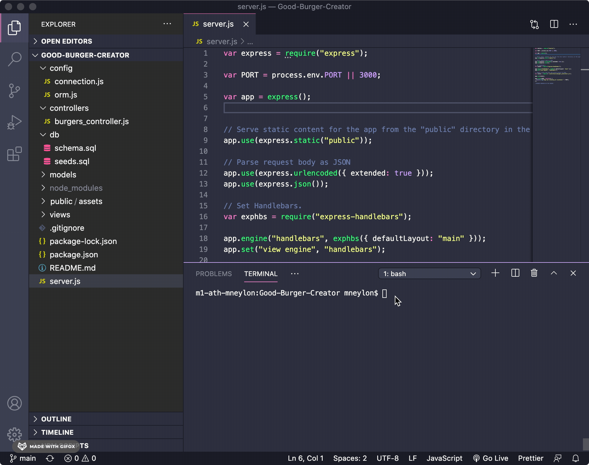

#  
### Description
  Lettuce, Meet Patty is the perfect place for a burger-fanatic to keep a list of burgers they would like to eat or burgers they have already devoured. This diner feel application uses MySQL, Node, Express, Handlebars and ORM to create the ultimate burger list.

### Heroku Link
  Link for Heroku can be found here: https://sheltered-beyond-99467.herokuapp.com/

## Table of Contents
  
* [Installation](#installation)
  
* [Usage](#usage)
  
* [License](#license)
  
* [Contributing](#contributing)
  
* [Tests](#tests)
  
* [Questions](#questions)

## Installation
  ```
  The user will need to npm install express, express-handlebars and mysql to have the application work.
  ```
  
## Usage
To start this application, open your terminal and type $ node server . This should display a messsage in the terminal telling you which local PORT the server is listening on. 

  

Now the application can be accessed in the browser at localhost:3000. The diner themed website will display! 

 

 You can now add burgers to your wish-list or place burgers you have eaten in the Devoured Burgers section. An easy way to keep track of your favorite or soon-to-be favorite burgers.

  

  Don't like a burger anymore? No worries! Simply erase it to remove it from either list. 

 


## License
  [](https://opensource.org/licenses/MIT)
  
## Contributing
  N/A
  
## Tests
  N/A
  
## Questions
  GitHub: [neylonmc]("https://github.com/neylonmc")
  Email: [neylonmc@gmail.com]("mailto:neylonmc@gmail.com") 
